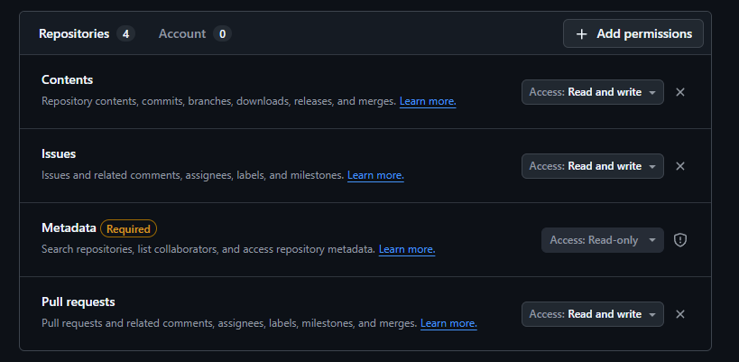
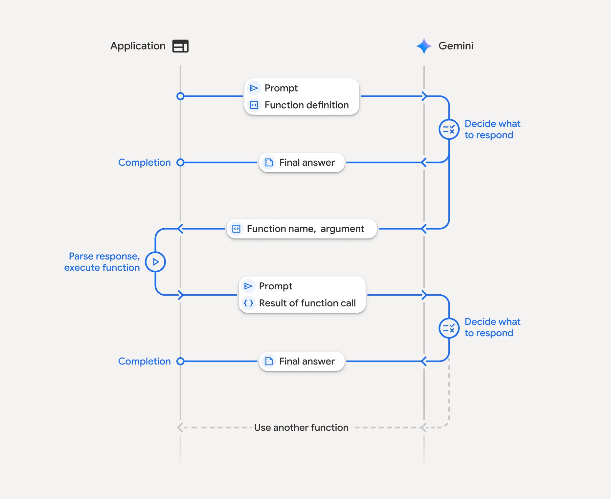
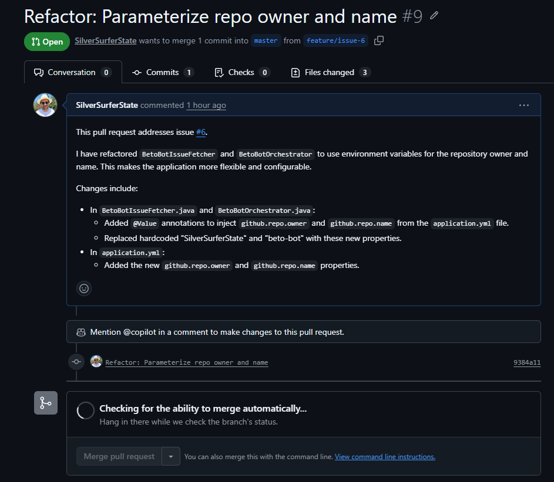
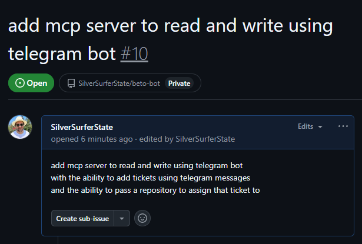
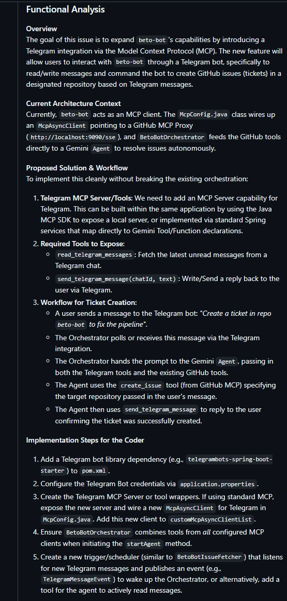
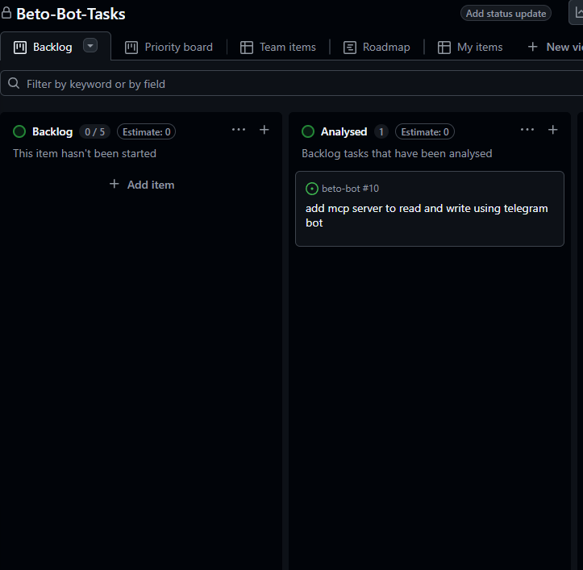
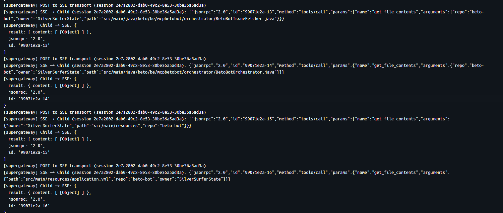

# 🤖 Beto-Bot: Custom Java Multi-Agent Orchestrator

  

This project is a custom Multi-Agent Orchestrator built in Java (Spring Boot). It connects to a Model Context Protocol (MCP) server to allow AI agents to interact with external tools (specifically, GitHub).


```angular2html
Update 12/4/2026

Latest changelog: 
-Our issues are now centralized in projects
-We can fetch project issues from any authorized repo for our token and analyse or code
-Can now facilitate either analysis or coding work depending on placement of issue on project
-Upgraded model to Gemini 3.1 PRO preview and Flash

Major Improvements:
-Refactored Agent into abstract class with two specific subAgents(coder, analyst)
-Refactored Scheduler, added in restClient GraphQL call to facilitate Projects
-Added more fields to GithubTask to facilitate Project item info
-Added ProjectService with 2 custom tools and config for projects
-Added CustomMcpParser to parse tools into Gemini
-Refactored the GithubParser to facilitate projects
-Orchestrator slimmed down, and now actually decides where to send the task(analyst or coder)

Minor Improvements:
-Updated to google gen AI version 1.47
-Upgraded to newest github mcp server, now also running docker instead of npx
(although we still run it with supergateway to bridge SSE <> STDIO)
```


## TL;DR
To get started just put your (currently) Gemini api key and your Github PAT in a environment variable.

TODO: dynamic repo injection

```
GITHUB_PERSONAL_ACCESS_TOKEN=<your github api key>
GOOGLE_API_KEY=<your gemini api key>
```

You can then run the docker-compose file to build both the MCP server and the application.

```docker
services:
  github-mcp:
    image: node:20
    container_name: github-mcp-proxy
    volumes:
      - /var/run/docker.sock:/var/run/docker.sock
    environment:
      - GITHUB_PERSONAL_ACCESS_TOKEN=${GITHUB_PERSONAL_ACCESS_TOKEN}
    command: >
      sh -c "
      apt-get update -qq && apt-get install -y docker.io -qq &&
      npx -y supergateway
      --stdio 'docker run -i --rm -e GITHUB_PERSONAL_ACCESS_TOKEN=$GITHUB_PERSONAL_ACCESS_TOKEN ghcr.io/github/github-mcp-server:latest stdio --toolsets repos,issues,pull_requests'
      --port 3000
      --host 0.0.0.0
      --ssePath /sse
      "
    ports:
      - "9090:3000"
    restart: always 
  
  
  beto-bot:  
    build: .  
    depends_on:  
      - github-mcp  
    environment:  
      - GOOGLE_API_KEY=${GOOGLE_API_KEY}
      - GITHUB_PROJECT_ID=${GITHUB_PROJECT_ID}
      - GITHUB_PERSONAL_ACCESS_TOKEN=${GITHUB_PERSONAL_ACCESS_TOKEN}
      - SPRING_AI_MCP_CLIENT_SSE_CONNECTIONS_GITHUB_URL=http://github-mcp:8080/sse
```
## 🏛️ Overview


The system consists of 5 main components:

1.  **MCP Client (using Spring AI mcp):** To create the connection to the Github mcp server running in docker
2. **Github MCP Server:** Github's MCP server with tools for anything github related 
	more here: https://github.com/github/github-mcp-server?tab=readme-ov-file#tools
3.  **LLM Agent:** The integration with an LLM (like Gemini or Claude) to handle reasoning and tool calling.

4.  **The Fetcher:** Periodically (30min) fetches issues from your repository on github and passes them to the orchestrator loop.

5. **The Orchestrator:** Connect the tools with the agent and iterate until we have a final answer.

  

---
## 🧰 The MCP Client (SSE - STDIO)

  
The McpClient is an McpAsyncClient that uses SSE to connect to a proxy running the MCP server.
It uses java's HttpClient with a SSE implementation of the MCP.io McpTransport.

From the docs: 
_This transport implementation establishes a bidirectional communication channel between client and server using SSE for server-to-client messages and HTTP POST requests for client-to-server messages._


- Establishes an SSE connection to receive server messages
- Handles endpoint discovery through SSE events
- Manages message serialization/deserialization using Jackson
- Provides graceful connection termination

- The transport supports two types of SSE events:
	- 'endpoint' - Contains the URL for sending client messages
	- 'message' - Contains JSON-RPC message payload

I added a block here to have the context halt initialization before the mcp connection has been fully made with a max duration of 30 seconds.

The MCPClient is configured in the McpConfig file.

```java
@Configuration  
public class McpConfig {  
  
    private final Logger logger = LoggerFactory.getLogger(McpConfig.class);  
  
    @Bean  
    @Primary    public McpAsyncClient githubMcpClient() {  
        String mcpUrl = "http://localhost:9090/sse";  
  
        var transport = HttpClientSseClientTransport.builder(mcpUrl)  
                .build();  
  
        var client = McpClient.async(transport)  
                .requestTimeout(Duration.ofMinutes(5)).build();  
        try {  
            logger.info("--- Connecting to GitHub MCP Proxy ---");  
            client.initialize()  
                    .retryWhen(Retry.fixedDelay(10, Duration.ofSeconds(2)))  
                    .block(Duration.ofSeconds(30));  
            logger.info("--- GITHUB MCP READY ---");  
        } catch (Exception e) {  
            logger.error("Failed to init with MCP Proxy: {}", e.getMessage());  
        }  
        return client;  
    }  
  
    @Bean  
    public List<McpAsyncClient> customMcpAsyncClientList(McpAsyncClient githubMcpClient) {  
        return List.of(githubMcpClient);  
    }  
}
```

It's returned as a List because the relationship between an Application and a MCP server can be 1:N so our application could be using github now but Github and a custom MCP tomorrow.

--- 

## 🖥️ The MCP Server

An MCP server is a like a toolbox, with a bunch of functions each tailored to work for an external service or whatever you configured it for. We want access to those tools so we can hand them off to our agent.
Our MCP Github server is running in a container with a proxy in between to manage SSE to STDIO translation.

basically:

```java

[beto-bot] <--SSE-->[proxy]<--STDIO-->[github mcp server]

```


There is not much setup for this because they guardrails are being enforced by the PAT you create in your github account. 

To be able to use the beto-bot with repositories we own, i created a fine grained personal access token in github ( currently for 30 days )
with the following access: 



---

## 🧑‍💼👷👷‍♂️LLM Agent

The integration of Gemini API has been made easy by Google through the Google GenAI Java SDK library.

source: https://ai.google.dev/gemini-api/docs/quickstart#java

This calls for a dependency to be added: 

```java
  <dependency>
    <groupId>com.google.genai</groupId>
    <artifactId>google-genai</artifactId>
    <version>1.47.0</version>
  </dependency>
```

The implementation is straightforward: 

You create a new Client, tell it which model you want to use, hand it a prompt and you're off.
For our needs, we also needed to hand the agent a bunch of tools, namely the Github tools.

So instead of a simple 'ask', that became an askWithTools:

#### Updated on 12/4/2026 : now an abstract class
```java 
public abstract class Agent {

	private final Logger logger = LoggerFactory.getLogger(Agent.class);
	private final Client client;
	private final String model;
	private final McpAsyncClient gitHubMcpClient;
	private final ProjectService projectService;

	public Agent(Client client, String model,
	             List<McpAsyncClient> customMcpAsyncClientList,
	             ProjectService projectService){
		this.client = client;
		this.model = model;
		this.gitHubMcpClient = customMcpAsyncClientList.getFirst();
		this.projectService = projectService;
	}

	public GenerateContentResponse askWithTools(List<Content> history, GenerateContentConfig config) {
		return client.models.generateContent(model, history, config);
	}

	public void start(GithubTask task, List<Tool> tools) {
		List<Content> history = new ArrayList<>();
		//hand it our initial prompt
		history.add(buildMessage(buildPrompt(task)));

		boolean finished = false;
		while (!finished) {
			GenerateContentConfig config = GenerateContentConfig.builder().tools(tools).build();
			GenerateContentResponse response = askWithTools(history, config);

			Content modelResponse = extractModelResponse(response);
			history.add(modelResponse);
			// sometimes we get multiple toolcalls in a response
			// we couldnt handle that, the agent would falsely finish
			// this adds the ability to handle multiple toolCalls
			List<FunctionCall> toolCalls = fetchAllToolCalls(modelResponse);
			if (!toolCalls.isEmpty()) {
				toolCalls.forEach(call -> executeToolAndAddToHistory(call, history));
			} else {
				String answer = extractText(modelResponse);
				if (answer != null && !answer.isBlank()){
					logger.info("---Answer: {}", extractText(modelResponse));
					finished = true;
				} else {
					// could be empty response || hanging agent
					logger.warn("Empty response, forcing agent to continue");
					history.add(buildMessage("Please continue with the next step or try your last step again."));
				}

			}
		}
	}
```

We now have 2 sub agents that extend our abstract Agent, keeping them simple and clean with just a prompt

```java
@Component
public class CodingAgent extends Agent {

    public CodingAgent(List<McpAsyncClient> customMcpAsyncClientList,
                       ProjectService projectService) {
        super(new Client(),
                "gemini-3-flash-preview",
                customMcpAsyncClientList,
                projectService);
    }

    @Override
    String buildPrompt(GithubTask task) {
        return String.format("""
                System context:
                Repository owner: SilverSurferState
                Repository name: %s
                you must always provide these owner and repo values when calling tools

                Task:
                You are senior Java Developer. You need to fix or implement the following issue:

                Title: %s
                Description: %s

                Todo:
                1. Use 'get_file_contents' with path='.' to list the root directory for this repo and to understand the project
                2. Once you understand the project, implement or fix the issue
                3. Create a new branch named 'feature/issue-%d'
                4. Use 'push_files' to commit your changes and to that branch you just created
                5. Add the label 'beto-bot:in-progress' to the issue you've processed.
                6. Finish by using 'create_pull_request' to create a new pull request and
                summarizing what you changed in the 'body' section of the 'create_pull_request' function.
                """,task.repository() , task.title(), task.body(), task.number());
    }
}
```

---

## 🛻 The Fetcher

Periodically checks if there are issues on a repository on github using the 'list_issues' tool and publishes an event that can be picked up by the orchestrator. 

In a later stage we can have different fetcher for different tasks and hand then off to another agent or the same agent but with a different prompt to perform multiple tasks.

Will : 

- fetch issues on a schedule ( 30 min )
	-  from a project on github /projects
	-  state: open
	-  in either the backlog or todo column ( status field )
	-  bundles them and adds a type ( analysis or coder )
- publishes a GithubTaskEvent

#### updated on 12/4/2026
```java
/**  
 * A scheduler to run a fetch every 30 min for issues on a specific github repository * This doesnt leverage any LLM, so its cheap in that sense */@Service  
public class BetoBotIssueFetcher {  
  
    private final Logger logger = LoggerFactory.getLogger(BetoBotIssueFetcher.class);  
    private final McpAsyncClient githubMcpClientImpl;  
    private final ApplicationEventPublisher applicationEventPublisher;  
  
    public BetoBotIssueFetcher(List<McpAsyncClient> customMcpAsyncClientList,  
                               ApplicationEventPublisher applicationEventPublisher) {  
        this.githubMcpClientImpl = customMcpAsyncClientList.getFirst();  
        this.applicationEventPublisher = applicationEventPublisher;  
    }

	@Scheduled(fixedRate = 18000000, initialDelay = 5000) // 30 min, delay 5s
	public void checkForAvailableWork() {
		logger.info(" --Checking for available work-- ");
		// get all available tasks in the project setup
		String availableTasks = getGithubTasks();
		// convert them to githubTasks with types
		List<GithubTask> githubTasks = GithubParser.parseTasksFromProject(availableTasks);
		// send events
		githubTasks.forEach(task -> publishEvent(task, task.type()));
	}

	private void publishEvent(GithubTask task, String type){
		applicationEventPublisher.publishEvent(new GitHubTaskEvent(this, task, type));
	}
}
```
#### updated on 12/4/2026
now also features a custom graphql call to fetch project issues since this is not yet possible using projectsV2 and MCP (KNOWN ISSUE)
```java
    private String getGithubTasks(){
        Map<String, String> body = Map.of(
                "query",
                """
                {
                  node(id: "%s") {
                    ... on ProjectV2 {
                      title
                      items(first: 20) {
                        nodes {
                          id
                          fieldValues(first: 10) {
                            nodes {
                              ... on ProjectV2ItemFieldSingleSelectValue {
                                name
                                field {
                                  ... on ProjectV2SingleSelectField {
                                    name
                                  }
                                }
                              }
                            }
                          }
                          content {
                            ... on Issue {
                              id
                              number
                              title
                              state
                              body
                              repository {
                                name
                                owner {
                                  login
                                }
                              }
                            }
                          }
                        }
                      }
                    }
                  }
                }
                """.formatted(projectId));

        return restClient.post()
                .uri("https://api.github.com/graphql")
                .header("Authorization", "bearer " + apiKey)
                .header("Content-Type", "application/json")
                .body(body)
                .retrieve()
                .body(String.class);
    }
```

#### updated on 12/4/2026 
The event:

```java
public class GitHubTaskEvent extends ApplicationEvent {

	private final GithubTask githubTask;
	private final String type;

	public GitHubTaskEvent(Object source, GithubTask task, String type) {
		super(source);
		this.githubTask = task;
		this.type = type;
	}

	public String getType() {
		return type;
	}

	public GithubTask getGithubTask() {
		return githubTask;
	}
}
```

---

## 🏭 The orchestrator 

The orchestrator functions as the main iterative process and has two main parts: 

- processTicket (the listener to the event from the Fetcher)
- startAgent (an LLM agent loop)

### 🎫 Processing Tickets ( issues )
First off, it gets all the tools from the MCP server using the McpAsyncClient with a functionCall "listTools".  It then continues on to build up a predefined prompt with the injected issue.

Then the fun starts.
Since were using java 21 we can use virtual threads.

Using a virtual thread resolves some potential bottlenecks: 

- they keep our main applications threads free, so the application doesnt hang if the agent should become stuck in a loop
- we disconnect the MCP Client's threads who are working towards the SSE-proxy streams from the agent's virtual thread, preventing a possible deadlock since the agent uses those.

eg: if the agent ran on the same thread, it could block the thread while waiting for a response from a tool creating a deadlock.

it also enables us to handle multiple issues at the same time, since virtual threads are lightweight.


#### updated on 12/4/2026

Now able to hand off to either the coding agent or analyst agent
it also groups both tools from the github mcp toollist and our custom mcp service tools 

```java
@EventListener
public void processEvent(GitHubTaskEvent taskEvent){
	GithubTask task = taskEvent.getGithubTask();
	githubMcpClientImpl.listTools() // hands agent tools from external mcp-server
			.timeout(Duration.ofSeconds(60)) // give the agent some time to think
			.doOnSuccess(toolsList -> {
				List<Tool> allTools = getAllTools(toolsList);
				if (task.type().equals("ANALYSIS")) {
					runAgent(task, allTools, analystAgent);
				} else if (task.type().equals("CODER")) {
					runAgent(task, allTools, codingAgent);
				}
			})
			.doOnError(error -> logger.error("Assignment failed: {}", error.getMessage()))
			.subscribe();
}

```

### 🏁Starting the agent loop

The agent loop start by building a track record of the conversation, here named 'history'.
Since we havent started our conversation yet, we can inject our prompt as the first part of that conversation. 

All the building blocks of the conversation use builder patterns which makes it quite easy to build up. However, every bit is also an Optional so we do have to jump through several hoops.

So how does the process take place?

it basically follows this loop : 

 source: https://ai.google.dev/gemini-api/docs/function-calling?example=weather#mcp-limitations

```markdown
initial prompt -> into history -> history -> agent -> checks prompt -> needs tools ? use tool from mcp server through client : return answer
```

the agentic loop starts and hands that history with the initial prompt off to the agent, this is the first time we'll call the agentic api

the agents keeps calling tools ( FunctionCall ) until it has enough information to satisfy our initial prompt, at which point it just returns an answer and we know its finished. Or "thinks" its finished.

#### updated on 12/4/2026

RunAgent also looking a lot cleaner now
```java
private void runAgent(GithubTask task,List<Tool> tools, Agent agent){
	// start virtual thread to have agents be non-blocking for platform threads
	logger.info(">>> Assigning {} agent for task: {} <<<", task.type(), task.number());
	Thread.ofVirtual().start(() -> {
		try {
			agent.start(task, tools);
		} catch (Exception e) {
			logger.error("Virtual Thread with agent failed: {}", e.getMessage());
		}
	});
}
```

You'll notice the piece on executeToolAndAddToHistory, this is a method i refactored from my first version because i noticed that when the agent was calling the repository with get_file_contents to know what it was supposed to be working on, basically get the context of the repo, it would return NOT FOUND and crash. 

Now that response is being fed back into the agent with an extra prompt to inform it of its mistake.

#### updated on 12/4/2026

Note on the executeToolAndAddToHistory, which has all been refactored to Agent:
The method now also features a more robust way of handling toolCallResponses
where i noticed that the LLM would sometimes request multiple tools at once and the code could
only handle singular responses for tools
this has been fixed as such : 

```java
            // sometimes we get multiple toolcalls in a response
            // we couldnt handle that, the agent would falsely finish
            // this adds the ability to handle multiple toolCalls
            List<FunctionCall> toolCalls = fetchAllToolCalls(modelResponse);
            if (!toolCalls.isEmpty()) {
                toolCalls.forEach(call -> executeToolAndAddToHistory(call, history));
            } else {
                String answer = extractText(modelResponse);
                if (answer != null && !answer.isBlank()){
                    logger.info("---Answer: {}", extractText(modelResponse));
                    finished = true;
                } else {
                    // could be empty response || hanging agent
                    logger.warn("Empty response, forcing agent to continue");
                    history.add(buildMessage("Please continue with the next step or try your last step again."));
                }
            }
```

extractModelResponse, extractText, mapGithubToolsToGemini are basically examples of some helper methods used to parse incoming response content to the appropriate Tool or Text or Schema

---
---

# some examples and logs

#### An issue i created 


#### And the agent's PR


#### another issue, this one being analysed





#### and the automatic move from backlog to analysed after its done: ( youll have to take my word for it, it move by itself ;) )



#### Application log output : 


#### Some examples of the MCP server proxy communication: 

#### you'll notice here the id here that increments +1 each progressive response




