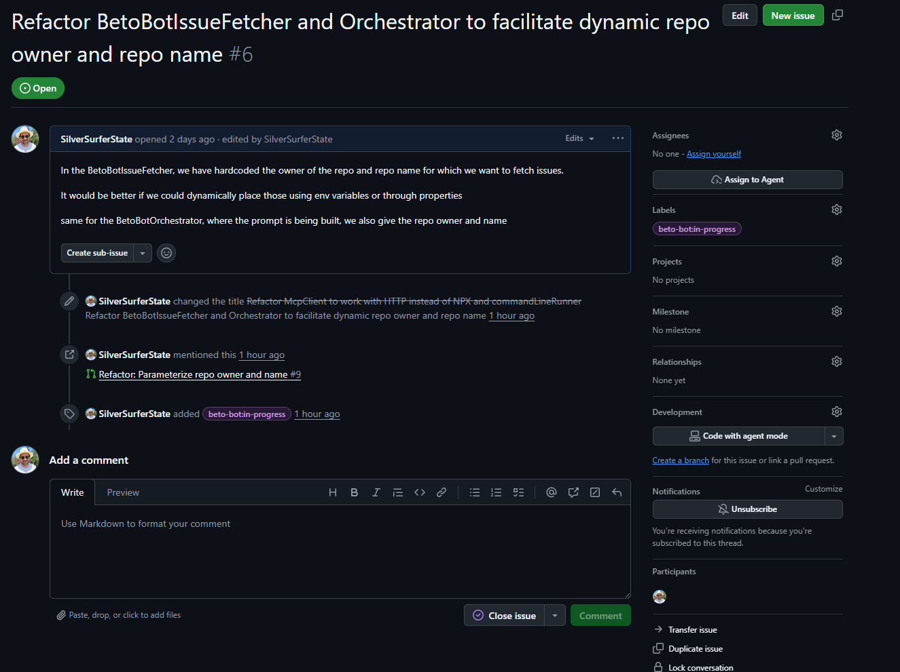
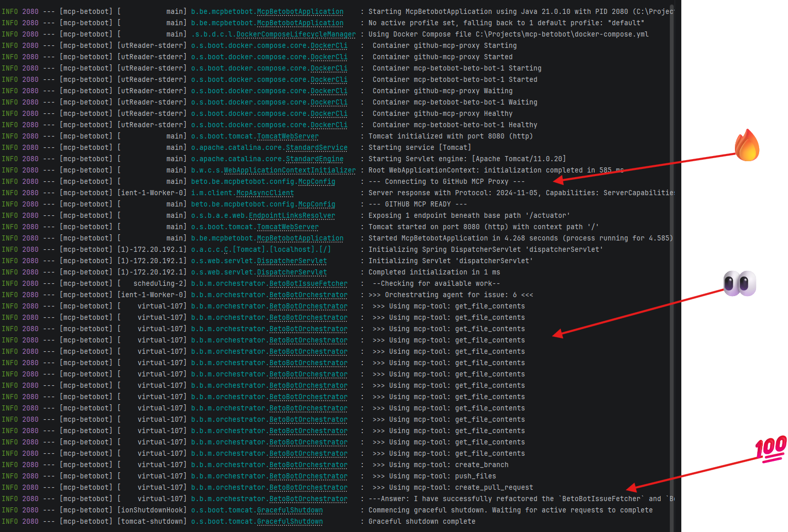

# 🤖 Beto-Bot: Custom Java Multi-Agent Orchestrator

  

This project is a custom Multi-Agent Orchestrator built in Java (Spring Boot). It connects to a Model Context Protocol (MCP) server to allow AI agents to interact with external tools (specifically, GitHub).

## TL;DR
To get started just put your (currently) Gemini api key and your Github PAT in a environment variable.

TODO: dynamic repo injection

```
GITHUB_PERSONAL_ACCESS_TOKEN=<your github api key>
GOOGLE_API_KEY=<your gemini api key>
```

You can then run the docker-compose file to build both the MCP server and the application.

```docker
services:  
  github-mcp:  
    image: node:20  
    container_name: github-mcp-proxy  
    environment:  
      - GITHUB_PERSONAL_ACCESS_TOKEN=${GITHUB_PERSONAL_ACCESS_TOKEN}  
    # We add --host 0.0.0.0 to ensure the proxy accepts external connections from Java  
    command: >  
      npx -y supergateway   
      --stdio "npx -y @modelcontextprotocol/server-github"   
      --port 3000   
      --host 0.0.0.0  
      --ssePath /sse  
    ports:  
      - "9090:3000"  
    restart: always  
  
  
  beto-bot:  
    build: .  
    depends_on:  
      - github-mcp  
    environment:  
      - GOOGLE_API_KEY=${GOOGLE_API_KEY}  
      - SPRING_AI_MCP_CLIENT_SSE_CONNECTIONS_GITHUB_URL=http://github-mcp:8080/sse
```
## 🏛️ Overview


The system consists of 5 main components:

1.  **MCP Client (using Spring AI mcp):** To create the connection to the Github mcp server running in docker
2. **Github MCP Server:** Github's MCP server with tools for anything github related 
	more here: https://github.com/github/github-mcp-server?tab=readme-ov-file#tools
3.  **LLM Agent:** The integration with an LLM (like Gemini or Claude) to handle reasoning and tool calling.

4.  **The Fetcher:** Periodically (30min) fetches issues from your repository on github and passes them to the orchestrator loop.

5. **The Orchestrator:** Connect the tools with the agent and iterate until we have a final answer.

  

---
## 🧰 The MCP Client (SSE - STDIO)

  
The McpClient is an McpAsyncClient that uses SSE to connect to a proxy running the MCP server.
It uses java's HttpClient with a SSE implementation of the MCP.io McpTransport.

From the docs: 
_This transport implementation establishes a bidirectional communication channel between client and server using SSE for server-to-client messages and HTTP POST requests for client-to-server messages._


- Establishes an SSE connection to receive server messages
- Handles endpoint discovery through SSE events
- Manages message serialization/deserialization using Jackson
- Provides graceful connection termination

- The transport supports two types of SSE events:
	- 'endpoint' - Contains the URL for sending client messages
	- 'message' - Contains JSON-RPC message payload

I added a block here to have the context halt initialization before the mcp connection has been fully made with a max duration of 30 seconds.

The MCPClient is configured in the McpConfig file.

```java
@Configuration  
public class McpConfig {  
  
    private final Logger logger = LoggerFactory.getLogger(McpConfig.class);  
  
    @Bean  
    @Primary    public McpAsyncClient githubMcpClient() {  
        String mcpUrl = "http://localhost:9090/sse";  
  
        var transport = HttpClientSseClientTransport.builder(mcpUrl)  
                .build();  
  
        var client = McpClient.async(transport)  
                .requestTimeout(Duration.ofMinutes(5)).build();  
        try {  
            logger.info("--- Connecting to GitHub MCP Proxy ---");  
            client.initialize()  
                    .retryWhen(Retry.fixedDelay(10, Duration.ofSeconds(2)))  
                    .block(Duration.ofSeconds(30));  
            logger.info("--- GITHUB MCP READY ---");  
        } catch (Exception e) {  
            logger.error("Failed to init with MCP Proxy: {}", e.getMessage());  
        }  
        return client;  
    }  
  
    @Bean  
    public List<McpAsyncClient> customMcpAsyncClientList(McpAsyncClient githubMcpClient) {  
        return List.of(githubMcpClient);  
    }  
}
```

It's returned as a List because the relationship between an Application and a MCP server can be 1:N so our application could be using github now but Github and a custom MCP tomorrow.

--- 

## 🖥️ The MCP Server

An MCP server is a like a toolbox, with a bunch of functions each tailored to work for an external service or whatever you configured it for. We want access to those tools so we can hand them off to our agent.
Our MCP Github server is running in a container with a proxy in between to manage SSE to STDIO translation.

basically:

```java

[beto-bot] <--SSE-->[proxy]<--STDIO-->[github mcp server]

```


There is not much setup for this because they guardrails are being enforced by the PAT you create in your github account. 

To be able to use the beto-bot with repositories we own, i created a fine grained personal access token in github ( currently for 30 days )
with the following access: 


---

## 🧑‍💼👷👷‍♂️LLM Agent

The integration of Gemini API has been made easy by Google through the Google GenAI Java SDK library.

source: https://ai.google.dev/gemini-api/docs/quickstart#java

This calls for a dependency to be added: 

```java
  <dependency>
    <groupId>com.google.genai</groupId>
    <artifactId>google-genai</artifactId>
    <version>1.0.0</version>
  </dependency>
```

The implementation is straightforward: 

You create a new Client, tell it which model you want to use, hand it a prompt and you're off.
For our needs, we also needed to hand the agent a bunch of tools, namely the Github tools.

So instead of a simple 'ask', that became an askWithTools:


```java 
@Service  
public class Agent {  
  
    //TODO try to implement other agents  
    private final Client client = new Client();  
    private final String GEMINI_PRO_2_5 = "gemini-2.5-pro";  
  
    public GenerateContentResponse askWithTools(List<Content> history, GenerateContentConfig config) {  
        // config for tools  
        return client.models.generateContent(GEMINI_PRO_2_5, history, config);  
    }  
}
```

---

## 🛻 The Fetcher

Periodically checks if there are issues on a repository on github using the 'list_issues' tool and publishes an event that can be picked up by the orchestrator. 

In a later stage we can have different fetcher for different tasks and hand then off to another agent or the same agent but with a different prompt to perform multiple tasks.

Will : 

- fetch issues on a schedule ( 30 min )
	-  from the granted repo//owner
	-  state = open
	-  with no labels ( more on that later )
	- parses the content it fetches into a text into a githubIssue
- publishes a GithubIssueEvent


```java
/**  
 * A scheduler to run a fetch every 30 min for issues on a specific github repo * This doesnt leverage any LLM, so its cheap in that sense */@Service  
public class BetoBotIssueFetcher {  
  
    private final Logger logger = LoggerFactory.getLogger(BetoBotIssueFetcher.class);  
    private final McpAsyncClient githubMcpClientImpl;  
    private final ApplicationEventPublisher applicationEventPublisher;  
  
    public BetoBotIssueFetcher(List<McpAsyncClient> customMcpAsyncClientList,  
                               ApplicationEventPublisher applicationEventPublisher) {  
        this.githubMcpClientImpl = customMcpAsyncClientList.getFirst();  
        this.applicationEventPublisher = applicationEventPublisher;  
    }  
  
    @Scheduled(fixedRate = 18000000, initialDelay = 5000) // 30 min, delay 5s  
    public void checkForAvailableWork() {  
        logger.info(" --Checking for available work-- ");  
        githubMcpClientImpl.callTool(new McpSchema.CallToolRequest("list_issues",  
                Map.of("owner", "SilverSurferState",  
                        "repo", "beto-bot",  
                        "state", "open",  
                        "labels", List.of())))  
                .flatMapIterable(result -> {  
                    String json = result.content().stream()  
                            .filter(content -> content instanceof McpSchema.TextContent)  
                            .map(content -> (((McpSchema.TextContent) content).text()))  
                            .findFirst()  
                            .orElse("");  
                    return Parser.parseIssues(json);  
                }).doOnNext(issue ->  
                        applicationEventPublisher.publishEvent(  
                                new GithubIssueEvent(this, issue)))  
                .subscribe();  
    }  
}
```

The event:

```java
package beto.be.mcpbetobot.events;  
  
import beto.be.mcpbetobot.messages.response.GithubIssue;  
import org.springframework.context.ApplicationEvent;  
  
public class GithubIssueEvent extends ApplicationEvent {  
  
    private final GithubIssue githubIssue;  
  
    public GithubIssueEvent(Object source, GithubIssue issue) {  
        super(source);  
        this.githubIssue = issue;  
    }  
  
    public GithubIssue getGithubIssue() {  
        return this.githubIssue;  
    }  
}
```

---

## 🏭 The orchestrator 

The orchestrator functions as the main iterative process and has two main parts: 

- processTicket (the listener to the event from the Fetcher)
- startAgent (an LLM agent loop)

### 🎫 Processing Tickets ( issues )
First off, it gets all the tools from the MCP server using the McpAsyncClient with a functionCall "listTools".  It then continues on to build up a predefined prompt with the injected issue.

Then the fun starts.
Since were using java 21 we can use virtual threads.

Using a virtual thread resolves some potential bottlenecks: 

- they keep our main applications threads free, so the application doesnt hang if the agent should become stuck in a loop
- we disconnect the MCP Client's threads who are working towards the SSE-proxy streams from the agent's virtual thread, preventing a possible deadlock since the agent uses those.

eg: if the agent ran on the same thread, it could block the thread while waiting for a response from a tool creating a deadlock.

it also enables us to handle multiple issues at the same time, since virtual threads are lightweight.


```java
@EventListener  
public void processTicket(GithubIssueEvent issueEvent){  
    GithubIssue issue = issueEvent.getGithubIssue();  
  
    logger.info(">>> Orchestrating agent for issue: {} <<<", issue.number());  
  
    githubMcpClientImpl.listTools() // hands agent tools from mcp  
            .timeout(Duration.ofSeconds(60)) // give the agent some time to think  
            .doOnSuccess(toolsList -> {  
                List<Tool> geminiTools = toolsList != null ? mapGithubToolsToGemini(toolsList.tools()) : Collections.emptyList();  
                String prompt = buildPrompt(issue);  
                // start thread to have it non-blocking  
                Thread.ofVirtual().start(() -> {  
                    try {  
                        startAgent(prompt, geminiTools);  
                    } catch (Exception e) {  
                        logger.error("Virtual Thread with agent failed: {}", e.getMessage());  
                    }  
                });  
            })  
            .doOnError(error -> logger.error("Orchestration failed: {}", error.getMessage()))  
            .subscribe();  
}
```

### 🏁Starting the agent loop

The agent loop start by building a track record of the conversation, here named 'history'.
Since we havent started our conversation yet, we can inject our prompt as the first part of that conversation. 

All the building blocks of the conversation use builder patterns which makes it quite easy to build up. However, every bit is also an Optional so we do have to jump through several hoops.

So how does the process take place?

it basically follows this loop : 

 source: https://ai.google.dev/gemini-api/docs/function-calling?example=weather#mcp-limitations

```markdown
initial prompt -> into history -> history -> agent -> checks prompt -> needs tools ? use tool from mcp server through client : return answer
```

the agentic loop starts and hands that history with the initial prompt off to the agent, this is the first time we'll call the agentic api

the agents keeps calling tools ( FunctionCall ) until it has enough information to satisfy our initial prompt, at which point it just returns an answer and we know its finished. Or "thinks" its finished.

```java
private void startAgent(String prompt, List<Tool> tools) {  
    List<Content> history = new ArrayList<>();  
    //hand it our initial prompt  
    history.add(buildMessage(prompt));  
  
    boolean finished = false;  
    while (!finished) {  
        GenerateContentConfig config = GenerateContentConfig.builder().tools(tools).build();  
        GenerateContentResponse response = agent.askWithTools(history, config);  
  
        Content modelResponse = extractModelResponse(response);  
        history.add(modelResponse);  
  
        Optional<FunctionCall> toolCall = fetchToolCall(modelResponse);  
        if (toolCall.isPresent()) {  
            executeToolAndAddToHistory(toolCall.get(), history);  
        } else {  
            logger.info("---Answer: {}", extractText(modelResponse));  
            finished = true;  
        }  
    }  
}
```

You'll notice the piece on executeToolAndAddToHistory, this is a method i refactored from my first version because i noticed that when the agent was calling the repository with get_file_contents to know what it was supposed to be working on, basically get the context of the repo, it would return NOT FOUND and crash. 

Now that response is being fed back into the agent with an extra prompt to inform it of its mistake.

extractModelResponse, extractText, mapGithubToolsToGemini are basically examples of some helper methods used to parse incoming response content to the appropriate Tool or Text or Schema

---
---

# some examples and logs

An issue i created 


And the agent's PR


Application log output : 



Some examples of the MCP server proxy communication: 

you'll notice here the id here that increments +1 each progressive response


